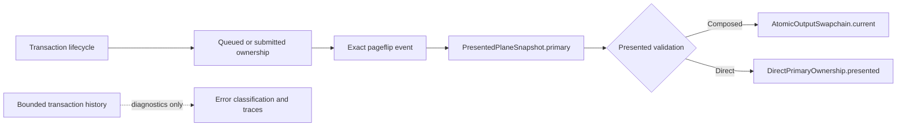

# Typhon Presented-Primary Authority Closure

Date: 2026-08-20

Repository: `/home/agony/GitHub/Typhon`

Baseline: `0ef9f7b99fa38d0fc04bf5ffa8f494db5a6eade6`

## Final status

The presented-primary authority closure is implemented and the task-directed
regression matrix is green. The current presented primary is now owned by the
presented plane resource, not reconstructed from bounded transaction history.

Repository-wide completion remains qualified by unrelated failures and by the
absence of a live DRM/Wayland/Sober qualification run. No claim of native
hardware qualification is made.

## Baseline and dirty-worktree warning

The worktree was already heavily dirty before this task began, including
unrelated compositor, WM, Xwayland, dependency, report, plan, and generated
files. The implementation preserved those changes and did not clean, reset, or
restore the worktree. The final working tree is therefore not a clean patch
boundary; attribution in this report is limited to the task-directed native
output files and their tests.

The terminal-history capacity remains 512 entries. It was not increased as a
way to hide the authority defect.

## Runtime evidence and root cause

The supplied runtime incident repeatedly exited with:

```text
MissingTransaction { owner: "current_composed", transaction_id: 18297 }
MissingTransaction { owner: "current_composed", transaction_id: 1567 }
MissingTransaction { owner: "current_composed", transaction_id: 6834 }
```

A separate Sober failure reported an “outdated” condition; it is independent of
the presented-primary history failure and was not used as evidence of this
closure.

The root cause was an ownership-model mismatch. A pageflip had already
promoted a composed primary into presented output state, but validation of that
current state still attempted to recover the transaction from the bounded
`OutputTransactionLedger`. Once the terminal record aged out, the resource was
physically presented but logically unverifiable, producing `MissingTransaction`
and causing the runtime to exit.

The ledger is appropriate for diagnosing active, queued, submitted, ready, and
terminal transaction state. It is not an authority for a resource that has
already crossed the pageflip boundary.

## Old and new ownership model

### Old model

The runtime carried a persistent `confirmed_primary_assignment` mirror and an
`OutputPipelineSnapshot.current_primary` mirror alongside
`PresentedPlaneSnapshot.primary`. Current validation then used the mirrored
transaction identity to consult the ledger, including terminal history.

This created two problems:

1. the same presented fact existed in multiple state holders; and
2. current validation depended on a bounded diagnostic data structure.

### New model

`PresentedPlaneSnapshot.primary` is the canonical presented-primary authority.
Transactions own their lifecycle transitions. Presented resources own their
presented state. History remains diagnostic only.

For a composed primary, the presented state records and validates:

- exact transaction and pageflip token;
- exact `KmsCommitBundleId` derived from that token;
- output generation and CRTC identity;
- current swapchain slot;
- framebuffer identity;
- pool generation; and
- presentation serial.

For a direct primary, the presented state records the pageflip identity and
validates against the actual `DirectPrimaryOwnership.presented` lease, including
transaction, token, surface, candidate key, and framebuffer identity.

The resulting authority flow is:



## Types and API changes

The task-directed API changes are:

- `ConfirmedPrimaryState` was replaced by `PresentedPrimaryState`; a type alias
  remains only as a compatibility spelling for existing model tests, not as a
  second state holder.
- `PresentedPrimaryState::Composed` now carries pageflip identity, slot,
  framebuffer, pool generation, and presentation serial.
- `PresentedPrimaryState::Direct` now carries pageflip identity in addition to
  direct scanout identity.
- `PlanePageflipIdentity::from_pageflip` centralizes exact token, bundle,
  generation, and CRTC construction.
- `PresentedPlaneSnapshot::promote_bundle` rejects a primary whose embedded
  pageflip identity differs from the bundle being promoted.
- `OutputPipelineSnapshot.current_primary` was removed. Its canonical source is
  `OutputPipelineSnapshot.presented_planes.primary`.
- The mirror-only `PresentedPrimaryMismatch` pipeline error was removed.
- `AtomicOutputSwapchain` now retains the typed current framebuffer identity and
  updates it on initial presentation and every completed pageflip.
- Explicit scanout exposes the real presented direct ownership through
  `explicit_presented_direct_ownership`.
- The presented validator is `validate_presented_primary`; it does not call
  `transaction_including_terminal`.

`transaction_including_terminal` remains in the active-owner diagnostic path so
that a submitted, queued, or worker-owned resource can still distinguish a
terminal owner from a genuinely missing record. It is no longer consulted to
authorize the already-presented primary.

## Composed, direct, worker, and transition behavior

### Composed path

Composed validation compares the recorded presented identity with the actual
`AtomicOutputSwapchain.current`, current framebuffer, pool generation, and
presentation serial. A mismatch in any one of those values is rejected with a
typed identity mismatch. The validator does not need the historical transaction
record to establish that the physical resource is current.

### Direct path

Direct validation requires the actual `DirectPrimaryOwnership.presented` lease.
It checks the exact transaction, token, surface, candidate key, and framebuffer.
Submitted-only, worker-only, and suspended-only ownership are rejected as
missing or non-presented ownership. A newer submitted replacement does not
invalidate the older lease merely because it exists; the presented lease is the
authority until the direct transition retires it.

### Worker and non-worker paths

Worker promotion now derives the presented identity from the exact worker job
pageflip and verifies the actual current swapchain slot and framebuffer before
publishing a composed primary. It carries the real pool generation and
presentation serial. Direct worker promotion carries the exact pageflip
identity and direct lease identity.

Non-worker pageflip handling promotes the primary and cursor as one exact
bundle, including when no cursor update is present. Bootstrap, suspend, resume,
and recovery paths clear or repopulate the canonical presented plane state at
the resource transition boundary rather than maintaining a separate confirmed
mirror.

## Regression coverage

The regression matrix includes:

- a red-first composed history-eviction regression: before the fix it failed
  with `MissingTransaction { owner: "current_composed", transaction_id: 1 }`;
- composed presented-primary survival after origin terminal history eviction;
- direct presented-primary survival after origin terminal history eviction;
- repeated cursor/plane-delta churn while the composed primary remains
  presented;
- composed negative checks for stale slot, framebuffer, pool generation,
  presentation serial, output generation, CRTC, bundle, and token identity;
- direct physical ownership mismatch checks;
- rejection of submitted-only and suspended-only direct ownership;
- worker promotion checks for current slot, framebuffer, pool generation, and
  presentation serial, including a wrong-framebuffer negative case;
- exact composed/cursor bundle promotion and stale identity rejection; and
- transition coverage for worker, direct, suspend, resume, and pageflip-owned
  state behavior already present in the native-output suite.

## Verification evidence

| Check | Result |
|---|---|
| `cargo fmt --all -- --check` | PASS |
| `cargo check --locked --all-targets` | PASS |
| `git diff --check` | PASS |
| Presentation-pipeline focused tests | PASS: 11 |
| Direct physical-ownership focused tests | PASS: 2 |
| Worker presented-identity focused test | PASS: 1 |
| Plane-scheduling focused tests | PASS: 5 |
| Native-output suite, one unrelated input test skipped | PASS: 851, 0 failed, 79 filtered |
| Full `cargo test --locked --quiet` | 1690 passed, 35 failed, 2 ignored |
| `cargo clippy --locked --all-targets -- -D warnings` | BLOCKED by 4 diagnostics outside this change |
| `bash bin/check-source-layout` | BLOCKED by 6 oversized files outside this change |

The full test failures are concentrated in `astreactl` and `xwayland` setup
tests. They fail with `InvalidInput: path must be shorter than SUN_LEN`,
followed by expected lock-poison cascades. They do not exercise the presented
primary closure and are outside the task-directed files.

The native-output suite was also run without the unrelated
`native_input_active_resize_updates_compositor_and_exact_client_cursor_motion`
test. That isolated test fails with `left 0 right 1` and a worker `RecvError`.
The remaining 851 native-output tests pass.

Clippy is blocked by these unrelated diagnostics:

- `src/compositor/state/frame_callbacks.rs:28` — `mutable_key_type`;
- `src/xwayland/xwm/event_types.rs:22` — `large_enum_variant`;
- `src/compositor/state/task_05_8_tests.rs:134` — `unnecessary_cast`; and
- `src/xwayland/xwm/events.rs:1416` — `single_element_loop`.

After extracting the task’s larger test modules, the source-layout checker
reports only these pre-existing or unrelated files:

- `src/compositor/tests/windows.rs` — 2002 lines, limit 2000;
- `src/compositor/state/desktop_windows.rs` — 1508, limit 1500;
- `src/compositor/state/windows.rs` — 1605, limit 1500;
- `src/compositor/server.rs` — 1544, limit 1500;
- `src/compositor/mod.rs` — 824, limit 800; and
- `src/xwayland/xwm/events.rs` — 1553, limit 1500.

The task-directed large modules are below the checker limits: the pageflip
implementation is 1338 lines and the presentation-pipeline implementation is
1443 lines, with focused tests extracted into adjacent test modules.

## Native qualification

No live DRM/Wayland/Sober qualification was performed in this environment. The
tests use deterministic swapchain and ownership fixtures; they prove the
authority and identity invariants but do not prove behavior on a physical GPU,
kernel, compositor session, or Sober build. The separate Sober “outdated”
result remains an external qualification item.

## Performance and safety impact

The presented validation path removes a bounded-history lookup and performs
constant-time comparisons against already-owned state. The change adds no new
allocation, DRM ioctl, blocking wait, or worker round trip. The added swapchain
identity fields are small typed scalars, and pageflip identity is `Copy`.

The safety improvement is stronger than increasing history capacity: a
presented resource remains valid for validation after its transaction record is
evicted, while active transaction ownership continues to receive diagnostic
history checks.

## Codebase evidence and references

The codebase-memory graph was used at verification tier 2 for the indexed Typhon
project generation `2026-08-20T23:08:01Z`. Coverage checks were run for the
task-directed paths. One parser partial-coverage report pointed at the
test-only `native_io_recorder` declaration in
`src/native_output/runtime/presentation.rs:115`; that line was read directly.
Coverage is therefore best-effort evidence, not a claim that unrelated dirty
files were exhaustively audited.

The external references reviewed for DRM/pageflip ownership terminology and
comparison are:

- [KWin DRM backend overview](https://github.com/KDE/kwin/blob/master/src/backends/drm/overview.md?plain=1)
- [KWin DRM backend sources](https://github.com/KDE/kwin/tree/master/src/backends/drm)
- [Aquamarine DRM backend](https://github.com/hyprwm/aquamarine/tree/main/src/backend/drm)

These references informed the comparison section only; Typhon’s local
pageflip, resource, generation, and lease invariants remain the authority for
this implementation.

## Remaining blockers and handoff

The implementation is ready for review of the task-directed native-output
change. Before declaring the repository fully clean, the following must be
handled separately:

1. qualify the output on a live DRM/Wayland/Sober environment;
2. investigate the isolated native input worker/resize test;
3. resolve or explicitly baseline the `SUN_LEN` socket-path test environment;
4. address the four unrelated Clippy diagnostics; and
5. address the six unrelated source-layout violations.

No commit or branch integration was performed because the worktree contains
substantial unrelated user changes.
