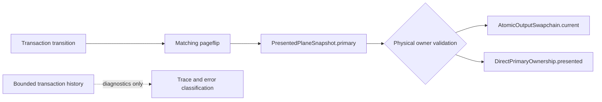

# Typhon Presented State Authority Decoupling

Date: 2026-08-20

Repository: `/home/agony/GitHub/Typhon`

Source baseline before this report commit: `d3dd5384b41dd791e41ba05c6ddd962d49cd4b07` (`cleanup`)

## Status

The presented-state authority decoupling is present in the current source.
Transactions own transitions and protocol obligations. Presented plane state
and physical resource owners own what is currently displayed. Transaction
history remains bounded diagnostic history and is not required to validate an
already-presented resource.

The terminal history capacity remains unchanged at 512. No old transaction is
pinned, and no invariant failure is downgraded to a warning.

## Previous failure and root cause

The failure was:

```text
output pipeline snapshot mismatch
MissingTransaction { owner: "current_composed", transaction_id: ... }
```

The old validation path attempted to recover the origin transaction for a
currently presented framebuffer from `OutputTransactionLedger`, including its
bounded terminal history. Correct eviction could therefore invalidate a
physically valid framebuffer:

```text
presented framebuffer
    -> origin transaction
    -> bounded terminal history
    -> eviction
    -> false invalidation
```

The defect was a lifetime and authority mismatch. The transaction owns the
transition to presentation; after the matching pageflip, the presented
resource owns the resulting state.

## Ownership model

### Before

Presented primary state was represented by synchronized mirrors, including
`current_primary` and `confirmed_primary_assignment`, while validation used the
origin transaction as a continuing validity source.

### After

`PresentedPlaneSnapshot.primary` is the canonical presented primary. The
transaction ID remains provenance metadata and diagnostics only.

Composed state carries the immutable physical identity needed for validation:

- origin transaction ID;
- exact pageflip identity, including token, bundle, output generation, and CRTC;
- swapchain slot;
- framebuffer ID;
- pool generation; and
- presentation serial.

Direct state carries:

- origin transaction ID;
- exact pageflip identity;
- framebuffer ID;
- surface ID; and
- candidate key, including its output generation.

The authority flow is:



## Validation behavior

Composed presented validation compares the snapshot against
`AtomicOutputSwapchain.current`, its current framebuffer, active pool
generation, current presentation serial, output generation, CRTC, token, and
bundle identity. History eviction succeeds when these physical identities still
match. A wrong slot, framebuffer, pool generation, presentation serial,
generation, CRTC, bundle, or token remains fatal.

Direct presented validation compares against
`DirectPrimaryOwnership.presented`. It requires a real presented lease and
checks transaction, token, framebuffer, surface, candidate key, pageflip
generation, and candidate-key generation. Submitted-only, worker-only, and
suspended-only ownership do not satisfy presented validation.

`transaction_including_terminal` remains only in active-owner diagnostics for
queued, submitted, ready, or worker-owned resources. It is not used to prove
the current presented primary.

## Pageflip and worker behavior

The pageflip is the ownership handoff. Before it, the transaction, worker, or
pending swapchain/direct lease owns the transition. After it, the canonical
presented snapshot and the physical owner own the result.

The worker path derives composed presented state from the exact worker pageflip
and requires the actual swapchain current slot and framebuffer to match. It
publishes the actual pool generation and presentation serial. The non-worker
path promotes the same exact pageflip bundle and physical identity. Direct
worker and non-worker paths publish the direct pageflip identity and presented
lease.

Transition coverage preserves the physical boundary:

- Direct → Composed releases the old direct lease only after a valid composed
  pageflip.
- Composed → Direct publishes direct state only after the direct pageflip.
- Direct → Direct retains the old direct resource until replacement pageflip.
- Suspend, resume, recovery, and failed transitions do not fabricate presented
  ownership.

## Regression coverage

The deterministic composed regression uses history capacity one, presents and
pageflips T0, evicts T0 with terminal transactions, and validates the current
pipeline snapshot. It passes without consulting T0’s history record. The direct
equivalent also passes.

The suite covers:

- composed and direct history eviction;
- stable-primary survival through cursor/plane churn and many terminal records;
- wrong framebuffer, slot, pool generation, presentation serial, output
  generation, CRTC, bundle, and token;
- wrong direct lease, surface, framebuffer, candidate key, and candidate
  generation;
- stale pageflip identity;
- Direct → Composed, Composed → Direct, and Direct → Direct transitions; and
- worker and non-worker pageflip promotion behavior.

## Verification

| Check | Result |
|---|---|
| `cargo fmt --all -- --check` | PASS |
| `cargo check --locked --all-targets` | PASS |
| Focused presented pipeline tests | PASS: 12 |
| Plane scheduling model | PASS: 22 |
| Triple-buffering model | PASS: 20 |
| Native-output suite excluding unrelated input worker test | PASS: 852, 0 failed |
| Full `cargo test --locked` | 1689 passed, 36 failed, 2 ignored |
| `cargo clippy --locked --all-targets -- -D warnings` | BLOCKED by 4 unrelated diagnostics |
| `bash bin/check-source-layout` | BLOCKED by 6 unrelated oversized files |

The full-test failures are concentrated in `astreactl` and `xwayland` setup
tests and report `InvalidInput: path must be shorter than SUN_LEN`, followed by
lock-poison cascades. This run also includes the unrelated
`process::tests::emergency_cleanup_terminates_dedicated_child_and_grandchild`
failure. The excluded native input test fails with `left 0 right 1` and a worker
`RecvError`.

Clippy remains blocked by unrelated diagnostics in:

- `src/compositor/state/frame_callbacks.rs:28`;
- `src/xwayland/xwm/event_types.rs:22`;
- `src/compositor/state/task_05_8_tests.rs:134`; and
- `src/xwayland/xwm/events.rs:1416`.

Source layout remains blocked by unrelated oversized files:

- `src/compositor/tests/windows.rs`;
- `src/compositor/state/desktop_windows.rs`;
- `src/compositor/state/windows.rs`;
- `src/compositor/server.rs`;
- `src/compositor/mod.rs`; and
- `src/xwayland/xwm/events.rs`.

No live DRM, Wayland, or Sober qualification was available, so this report does
not claim physical-GPU qualification.

## Commit history and discipline

The implementation currently exists in:

```text
9388731c13ab64e5389c7dd3062a557055443f1b  Wallpaper & Bug Fixes
```

That existing commit contains the presented-state implementation and tests but
also contains 173 files of unrelated work. The later cleanup commit is:

```text
d3dd5384b41dd791e41ba05c6ddd962d49cd4b07  cleanup
```

It removed several reports, including earlier authority reports, without
removing the implementation. The worktree currently has one unrelated deleted
`.codex/config.toml`.

The requested five-commit split cannot be created safely on this checkout
without rewriting the existing combined `9388731` commit or staging unrelated
files. No history rewrite was performed. This report is the only new file
created for the current request and was committed independently as:

```text
docs(output): document presented state authority model
```

## References

- [KWin DRM backend overview](https://github.com/KDE/kwin/blob/master/src/backends/drm/overview.md?plain=1)
- [KWin DRM backend sources](https://github.com/KDE/kwin/tree/master/src/backends/drm)
- [Aquamarine DRM backend](https://github.com/hyprwm/aquamarine/tree/main/src/backend/drm)
