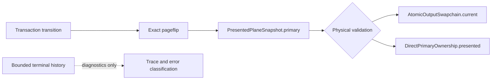

# Typhon Presented State Ownership Refactor

Date: 2026-08-20

Repository: `/home/agony/GitHub/Typhon`

Baseline commit: `0ef9f7b99fa38d0fc04bf5ffa8f494db5a6eade6`

## Status

The native-output presented-state ownership refactor is implemented. A
physically valid presented primary no longer requires its origin transaction to
remain in `OutputTransactionLedger` terminal history.

The ledger history capacity remains unchanged at 512. No transaction is pinned
to preserve validation, and no physical validation was weakened.

Repository-wide verification remains qualified by unrelated dirty-worktree
changes, environment-dependent test failures, and the absence of live DRM,
Wayland, and Sober qualification.

## Root cause

The runtime error was:

```text
output pipeline snapshot mismatch
MissingTransaction { owner: "current_composed", transaction_id: ... }
```

The current hardware framebuffer had already been promoted by a matching
pageflip, but presented validation still tried to recover its origin
transaction from bounded terminal history. Correct history eviction therefore
made a physically valid resource appear invalid:

```text
current hardware state
        -> historical transaction record
        -> bounded history deque
```

This was an ownership error, not a history-capacity problem. Transactions own
logical transitions and protocol obligations. Presented resources own the
state that is physically on the output. History records what happened and
supports diagnostics; it does not keep the display alive.

## Architecture comparison

KWin’s DRM model separates the atomic commit transition from the plane’s
current buffer: after the kernel pageflip, the plane owns the resulting
presented resource. Aquamarine similarly validates the back framebuffer at the
pageflip boundary before it becomes the front framebuffer and the previous
resource is released.

Typhon now follows the same ownership boundary:



References reviewed:

- [KWin DRM backend overview](https://github.com/KDE/kwin/blob/master/src/backends/drm/overview.md?plain=1)
- [KWin DRM backend sources](https://github.com/KDE/kwin/tree/master/src/backends/drm)
- [Aquamarine DRM backend](https://github.com/hyprwm/aquamarine/tree/main/src/backend/drm)

## Old architecture

The previous model had multiple representations of the same presented primary:

- `confirmed_primary_assignment` in runtime state;
- `OutputPipelineSnapshot.current_primary`; and
- `PresentedPlaneSnapshot.primary`.

Validation of the current composed primary then consulted transaction history to
decide whether the origin transaction still existed. That made the physical
resource’s validity depend on a bounded logical-history data structure.

## New architecture

`PresentedPlaneSnapshot.primary` is now the one canonical presented-primary
state. The transaction ID remains provenance and diagnostics; it is not the
resource’s lifetime authority.

For composed presentation, `PresentedPrimaryState::Composed` carries:

- origin transaction ID;
- exact pageflip identity, including token, bundle, output generation, and CRTC;
- current swapchain slot;
- framebuffer ID;
- pool generation; and
- presentation serial.

Validation compares those values with `AtomicOutputSwapchain.current`, its
current framebuffer, active pool generation, current presentation serial, and
the active output generation/CRTC. A real mismatch is still fatal. History
eviction is not.

For direct presentation, `PresentedPrimaryState::Direct` carries:

- origin transaction ID;
- exact pageflip identity;
- framebuffer ID;
- surface ID; and
- direct candidate key.

Validation compares this state with the actual
`DirectPrimaryOwnership.presented` lease. It also rejects a stale candidate-key
output generation, stale pageflip generation, wrong framebuffer, wrong surface,
wrong candidate key, or missing presented lease.

## Code changes

- Removed the persistent `current_primary` and
  `confirmed_primary_assignment` state mirrors.
- Removed the `ConfirmedPrimaryState` compatibility spelling; code now uses
  `PresentedPrimaryState` consistently.
- Removed the mirror-only `PresentedPrimaryMismatch` validation error.
- Added `PlanePageflipIdentity::from_pageflip` for exact identity construction.
- Made bundle promotion reject a primary whose embedded pageflip identity does
  not match the promoted bundle.
- Added typed current-framebuffer ownership to `AtomicOutputSwapchain`.
- Updated initial presentation and completed pageflips to publish the current
  framebuffer identity.
- Exposed the real presented direct ownership from explicit scanout.
- Kept `transaction_including_terminal` only for active, queued, submitted, or
  worker-owned resource diagnostics.
- Removed it from already-presented-primary validation.

## Worker and non-worker parity

The worker path derives presented state from the exact worker job pageflip and
requires the actual swapchain current slot and framebuffer to match before
promotion. It records the actual pool generation and presentation serial.

The non-worker path performs the same exact pageflip promotion and publishes
the same physical identity fields. Direct worker and non-worker paths both
publish the direct pageflip identity and direct presented lease state.

Transition behavior remains resource-boundary based:

- Direct → Composed releases the presented direct lease only after the
  composited pageflip is valid.
- Composed → Direct publishes direct state only after the direct pageflip.
- Direct → Direct retains the old direct resource until the replacement
  pageflip.
- Suspend, resume, recovery, and failed transitions clear or retain canonical
  presented ownership according to the proven physical boundary.

## Tests

The deterministic history-eviction regression uses a history capacity of one:

1. present composed T0;
2. complete its pageflip;
3. promote T0 as current;
4. evict T0 from terminal history; and
5. validate the pipeline snapshot.

It now passes. The direct equivalent also passes.

Coverage includes:

- composed and direct history eviction;
- repeated cursor/plane churn with a stable primary;
- many terminal records after the presented origin;
- wrong composed slot, framebuffer, pool generation, presentation serial,
  output generation, CRTC, bundle, and token;
- wrong direct framebuffer, surface, candidate key, lease, and candidate-key
  generation;
- submitted-only and suspended-only direct ownership;
- stale pageflip identity;
- Direct → Composed, Composed → Direct, and Direct → Direct transitions;
- worker current slot/framebuffer/pool/serial identity; and
- exact pageflip bundle promotion for primary and cursor planes.

The direct candidate-generation test was first run against the old behavior and
failed with `Ok(())` where an `output_generation` identity mismatch was
required. After the production check was added, it passed.

## Verification

| Command or scope | Result |
|---|---|
| `cargo fmt --all -- --check` | PASS |
| `cargo check --locked --all-targets` | PASS |
| Focused presentation pipeline tests | PASS: 12 |
| Plane scheduling model | PASS: 22 |
| Triple-buffering model | PASS: 20 |
| Native output suite excluding unrelated input worker test | PASS: 852, 0 failed |
| Full `cargo test --locked` | 1690 passed, 35 failed, 2 ignored |
| `cargo clippy --locked --all-targets -- -D warnings` | BLOCKED by 4 unrelated diagnostics |
| `bash bin/check-source-layout` | BLOCKED by 6 unrelated oversized files |

The full-test failures are concentrated in `astreactl` and `xwayland` setup
tests. They fail with `InvalidInput: path must be shorter than SUN_LEN`,
followed by lock-poison cascades. The isolated native input failure is
`native_input_active_resize_updates_compositor_and_exact_client_cursor_motion`,
which reports `left 0 right 1` and a worker `RecvError`.

The unrelated Clippy diagnostics are:

- `src/compositor/state/frame_callbacks.rs:28` — `mutable_key_type`;
- `src/xwayland/xwm/event_types.rs:22` — `large_enum_variant`;
- `src/compositor/state/task_05_8_tests.rs:134` — `unnecessary_cast`; and
- `src/xwayland/xwm/events.rs:1416` — `single_element_loop`.

The unrelated source-layout violations are:

- `src/compositor/tests/windows.rs` — 2002 lines, limit 2000;
- `src/compositor/state/desktop_windows.rs` — 1508, limit 1500;
- `src/compositor/state/windows.rs` — 1605, limit 1500;
- `src/compositor/server.rs` — 1544, limit 1500;
- `src/compositor/mod.rs` — 824, limit 800; and
- `src/xwayland/xwm/events.rs` — 1553, limit 1500.

Codebase-memory verification used the Typhon project at generation
`2026-08-20T23:37:57Z`. All task-directed paths reported no recorded coverage
issue. The graph remains best-effort; the known parser partial range at
`src/native_output/runtime/presentation.rs:115` was read directly.

## Runtime and native qualification

The runtime failure mechanism is covered deterministically, and the presented
validator now checks the physical ownership objects directly. No live DRM,
Wayland, or Sober qualification was available in this environment, so this
report makes no claim about a physical GPU or compositor session. The separate
Sober “outdated” result remains an external qualification item.

## Performance and remaining limitations

Presented validation now removes a bounded-history lookup from the hot path. It
adds no allocation, lock, blocking wait, DRM ioctl, extra KMS commit, or worker
round trip. The added identity fields are small typed scalars and pageflip
identity is `Copy`.

Remaining limitations are unrelated repository cleanliness, the socket-path
test environment, the isolated native input test, and pending live native
qualification. The worktree was already heavily dirty; no reset, cleanup,
commit, or branch integration was performed.
